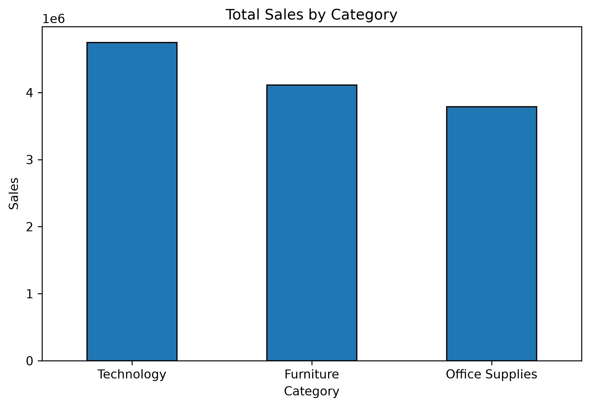
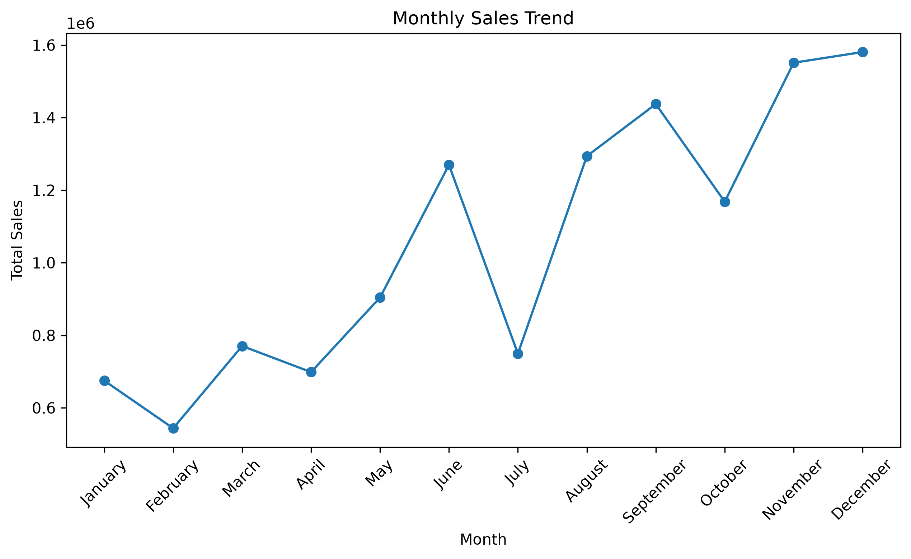
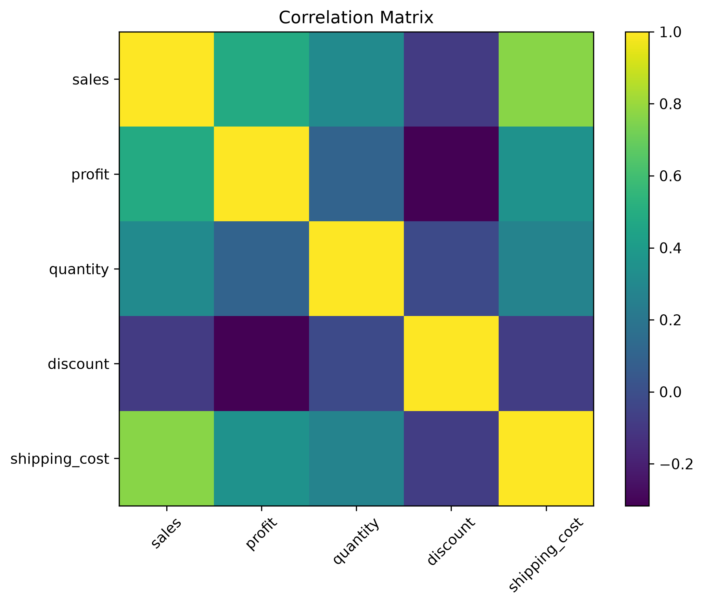

# Sales Performance Analysis

A complete end-to-end Data Analysis project using **Python, Pandas, Matplotlib, and MySQL** to analyze retail sales data and generate actionable business insights.

---

## Project Highlights

- Performed Data Cleaning & Preprocessing
- Conducted Exploratory Data Analysis (EDA)
- Created meaningful visualizations
- Solved 40+ SQL business queries
- Analyzed sales, profit, customers, products, and regional performance
- Generated business insights from data

---

## Tech Stack

| Technology | Purpose |
|------------|---------|
| Python | Data Analysis |
| Pandas | Data Cleaning & Manipulation |
| Matplotlib | Data Visualization |
| MySQL | Business Query Analysis |
| Jupyter Notebook | Project Development |
| Git | Version Control |
| GitHub | Project Hosting |

---

## Skills Demonstrated

- Data Cleaning
- Exploratory Data Analysis (EDA)
- Feature Engineering
- Data Visualization
- SQL Query Writing
- Business Insight Generation
- Data Storytelling

---

## Project Workflow

```text
Raw Dataset
      │
      ▼
Data Cleaning
      │
      ▼
Feature Engineering
      │
      ▼
Exploratory Data Analysis
      │
      ▼
Data Visualization
      │
      ▼
SQL Analysis
      │
      ▼
Business Insights
```

---

## 📷 Project Screenshots

### Sales by Category



### Monthly Sales Trend



### Correlation Matrix



### Discount vs Profit


## SQL Analysis

Business analysis was also performed using MySQL. The SQL queries included:

- Aggregate Functions
- GROUP BY
- ORDER BY
- CASE Statements
- Window Functions
- Ranking Functions
- Sales & Profit Analysis
- Customer Analysis
- Product Analysis
- Regional Analysis

## Project Structure

Sales-Performance-Analysis/

├── images/

├── Sales_Performance_Analysis.ipynb

├── superstore.csv

└── README.md

## How to Run

1. Clone this repository.
2. Install the required Python libraries.
3. Open the Jupyter Notebook.
4. Run all cells sequentially.
5. Explore the visualizations and business insights.

## Future Improvements

- Develop an interactive Power BI dashboard.
- Build sales forecasting models using Machine Learning.
- Create a web-based dashboard for real-time analysis.

## Author

**Yuganshi Bisen**

B.Sc. Mathematics Student

Aspiring Data Analyst